# Ragdoll Demo - User Manual

Welcome to the Ragdoll Demo application, a comprehensive demonstration of the Ragdoll document processing and search engine. This manual will guide you through a complete workflow from start to finish, showing how to upload documents, process them, and perform semantic searches.

## Table of Contents

1. [Getting Started](#getting-started)
2. [Complete Workflow Tutorial](#complete-workflow-tutorial)
3. [Feature Deep Dive](#feature-deep-dive)
4. [Advanced Features](#advanced-features)
5. [Troubleshooting](#troubleshooting)

---

## Getting Started

### Prerequisites

Before running the Ragdoll Demo application, ensure you have:

- Ruby 3.4.4+
- Rails 8.0.2+
- PostgreSQL with vector extensions (pgvector)
- Node.js for asset compilation

### Quick Start

The easiest way to start the application:

```bash
./bin/dev
```

This command will:
- Clean up any existing processes automatically
- Update gems if needed
- Check and setup the database
- Run pending migrations
- Start the Rails server on port 3000
- Start the background job worker

### Access Points

- **Main Application**: http://localhost:3000
- **Job Dashboard**: http://localhost:3000/mission_control/jobs

### Stopping the Application

```bash
./bin/stop
```

---

## Complete Workflow Tutorial

This section walks you through a complete workflow, from first opening the application to performing your first semantic search. We'll use biblical documents as examples to demonstrate the system's capabilities.

### Step 1: Starting with an Empty System

When you first access the Ragdoll Demo application at `http://localhost:3000`, you'll see an empty dashboard:

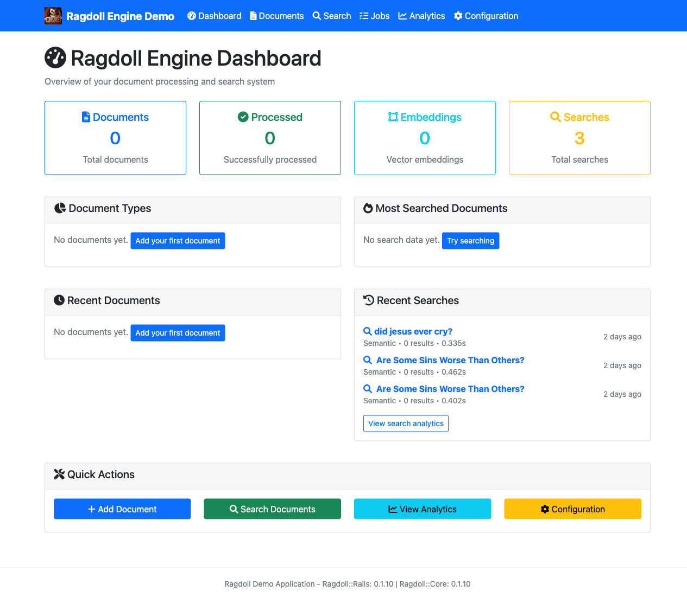

The dashboard shows:
- **Zero documents** in the system
- **No search activity** yet
- **Navigation menu** providing access to all features
- **Quick action buttons** to get started

### Step 2: Accessing Document Management

Click on "Documents" in the navigation menu to access the document management area:

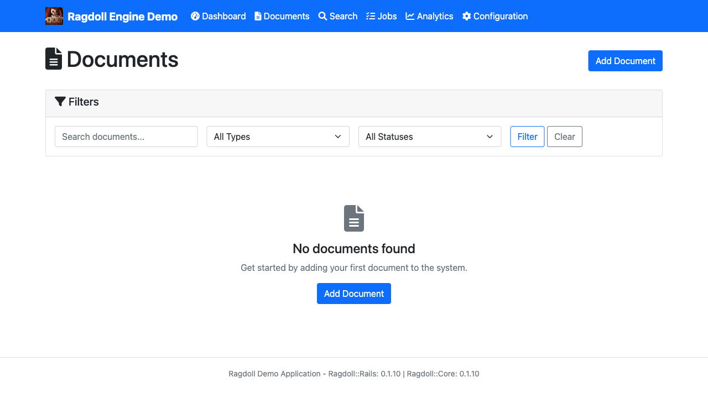

The empty documents page displays:
- **No documents** message indicating a fresh start
- **"Upload New Document"** button prominently displayed
- **Clean interface** ready for your first upload

### Step 3: Uploading Your First Document

Click "Upload New Document" to access the upload form:


The upload form provides:
- **File selection** with drag-and-drop support
- **Multiple upload options** (single file, bulk upload, directory upload)
- **Format support** for various document types
- **Processing options** for different scenarios

### Step 4: Selecting a Document

For this example, we'll upload a biblical document (`The Bible.md` - 16,642 characters):

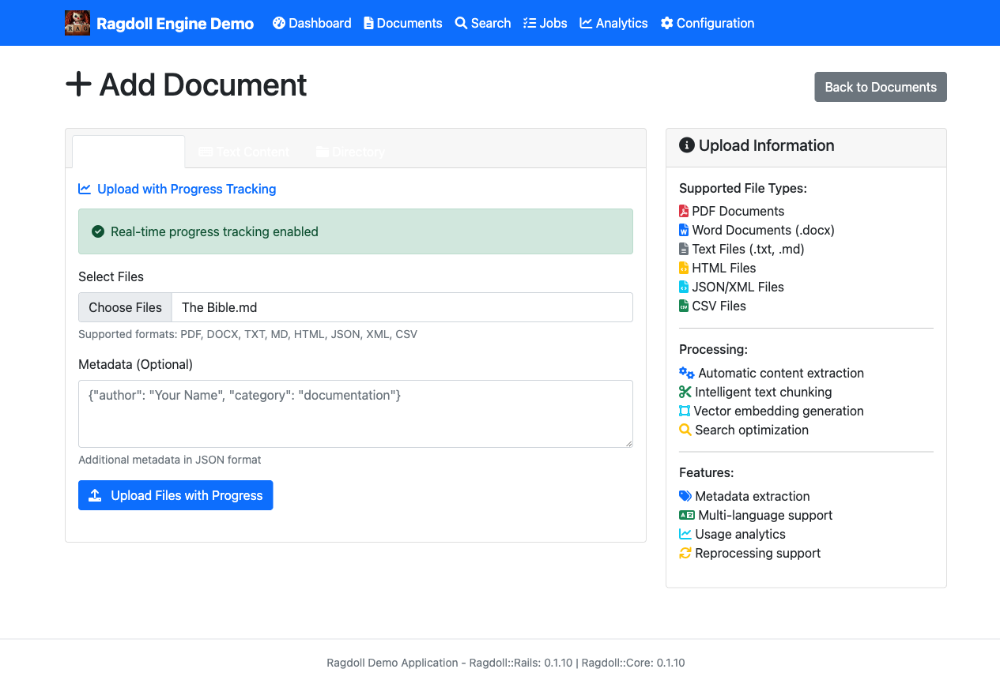

Once you select a file:
- **File name** appears in the upload field
- **File size** and type are detected
- **Upload button** becomes active
- **Processing options** can be configured

### Step 5: Document Processing Begins

After clicking "Upload Document", the system begins processing:

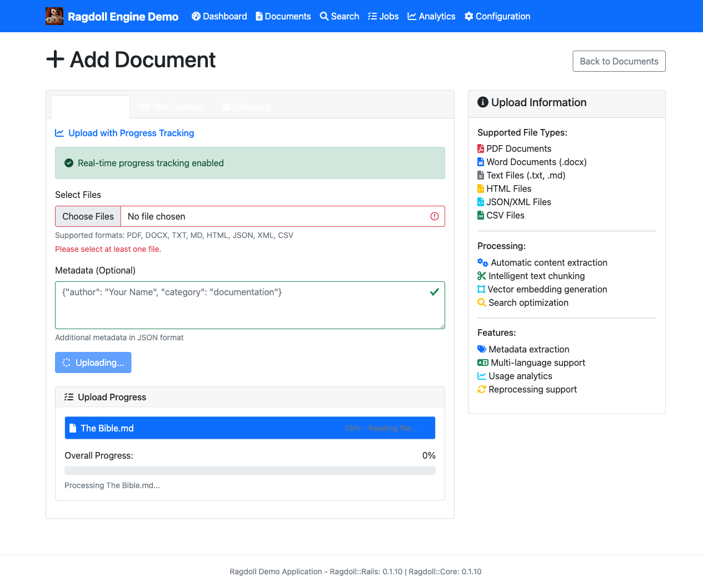

During processing:
- **Success message** confirms upload
- **Background jobs** are queued automatically
- **Processing status** is tracked
- **User interface** remains responsive

### Step 6: Monitoring Processing Status

Check the documents page to see your uploaded document:

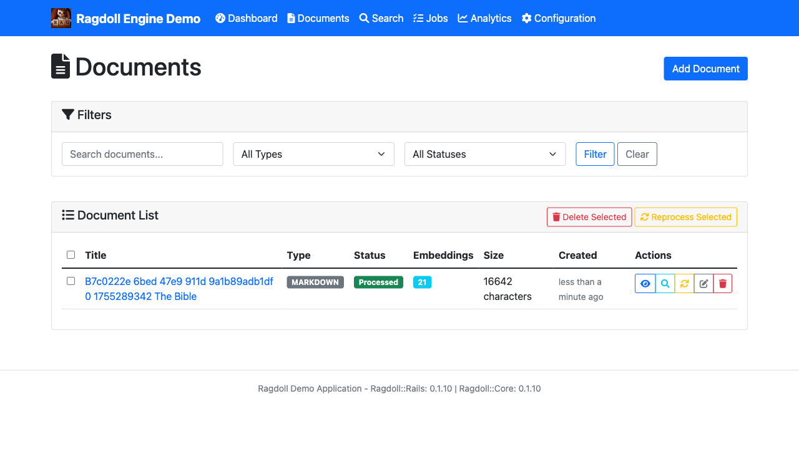

The document appears with:
- **Document title** extracted from filename
- **Processing status** indicator
- **Metadata** being generated
- **Action buttons** for management

### Step 7: Background Job Monitoring

Visit the Jobs dashboard at `/jobs` to monitor processing:

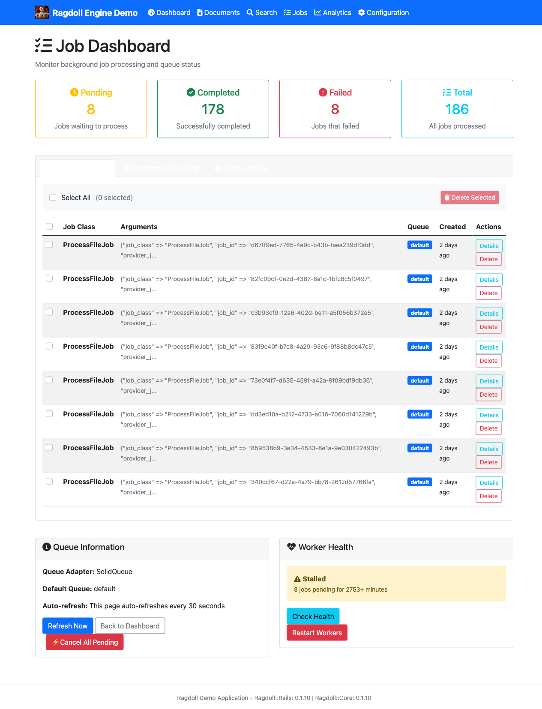

The jobs dashboard shows:
- **Active jobs** currently running
- **Processing stages** (text extraction, chunking, embeddings)
- **Job status** and completion times
- **Worker health** indicators

### Step 8: Completed Processing

After processing completes, the dashboard updates with statistics:

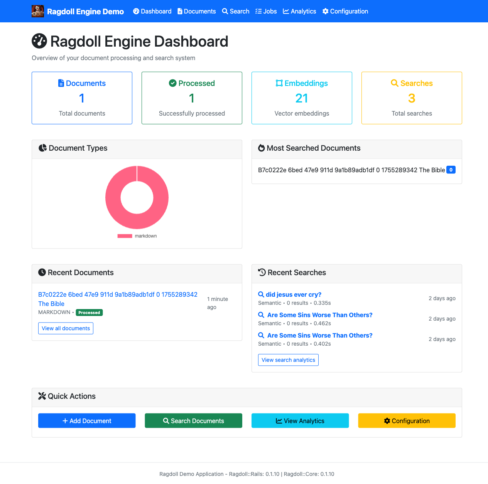

The updated dashboard shows:
- **Document count** now showing "1"
- **Processing completion** indicated
- **Search capabilities** now available
- **System ready** for semantic search

### Step 9: Performing Your First Search

Navigate to the Search page and enter a natural language query:

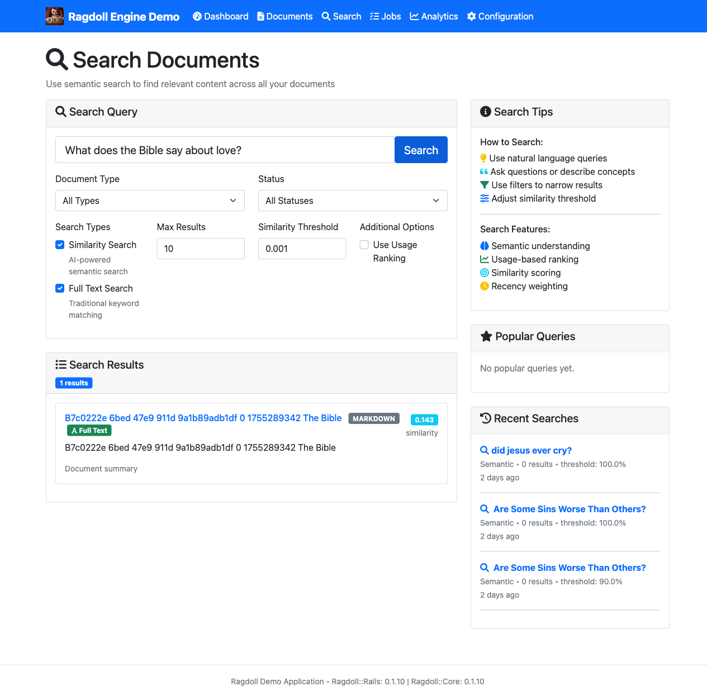

The search demonstrates:
- **Natural language query**: "What does the Bible say about love?"
- **Semantic understanding** finding relevant content
- **Highlighted results** showing relevant passages
- **Relevance scoring** ranking results by similarity

### Workflow Summary

This complete workflow demonstrates:

1. **Zero to Productive**: From empty system to searchable content in minutes
2. **Automatic Processing**: Documents are processed without manual intervention
3. **Background Jobs**: Long-running tasks don't block the user interface
4. **Semantic Search**: Natural language queries find meaningful results
5. **Real-time Monitoring**: Track processing status and job completion
6. **Rich Results**: Search results include context and relevance scoring

---

## Feature Deep Dive

Now that you've seen the basic workflow, let's explore each feature in detail.

### Dashboard Overview

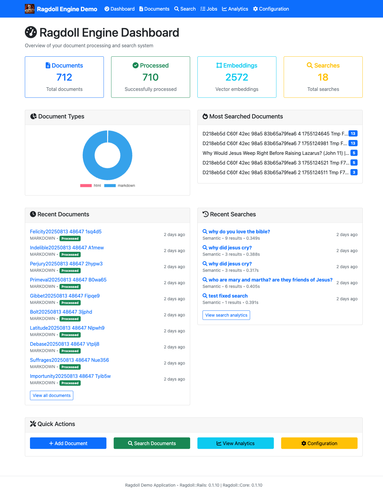

The dashboard provides:
- **System Statistics**: Document counts, processing status, search metrics
- **Quick Actions**: Direct access to upload and search functions
- **Navigation Hub**: Access to all application features
- **Health Indicators**: Real-time system status

### Document Management Features


Advanced document features include:
- **Bulk Operations**: Process multiple documents simultaneously
- **Status Tracking**: Monitor processing progress in real-time
- **Metadata Management**: Edit titles, descriptions, and keywords
- **Reprocessing**: Update embeddings with new models
- **Preview Mode**: View document content and extracted metadata

### Search Capabilities

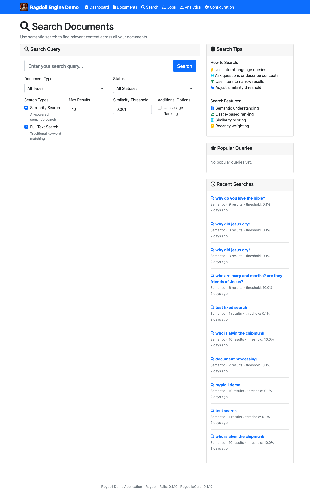

The search system offers:

#### Search Types
- **Semantic Search**: Find documents by meaning and context
- **Keyword Search**: Traditional text-based matching
- **Hybrid Search**: Combines semantic and keyword approaches
- **Filtered Search**: Narrow results by metadata and attributes

#### Search Features
- **Natural Language Queries**: Ask questions in plain English
- **Relevance Scoring**: Results ranked by similarity and importance
- **Context Highlighting**: Shows relevant passages within documents
- **Search History**: Track and replay previous searches
- **Export Results**: Download search results for external analysis

#### Advanced Search Techniques
- **Conceptual Queries**: Find documents about topics without exact keywords
- **Comparative Searches**: Find similar documents or contrasting viewpoints
- **Temporal Queries**: Search within specific time periods or contexts
- **Multi-language Support**: Search across documents in different languages

### Analytics & Insights

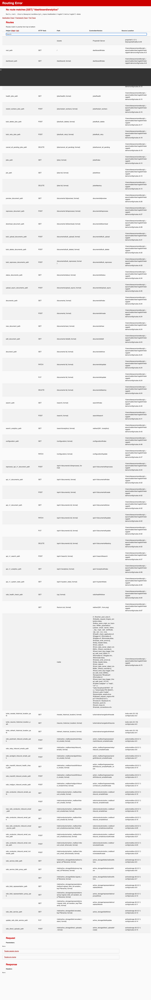

The Analytics dashboard provides comprehensive insights into system usage and performance.

### Key Metrics

- **Search Performance**: Query response times and success rates
- **Popular Queries**: Most frequently searched terms
- **Document Usage**: Which documents are accessed most
- **Similarity Score Distribution**: Quality metrics for search results

### Usage Trends

- **Search Volume**: Queries over time
- **Document Processing**: Upload and processing statistics
- **User Engagement**: Interaction patterns and session data
- **System Performance**: Response times and resource usage

### Visual Analytics

- **Interactive Charts**: Drill down into specific metrics
- **Time Range Selection**: View data for different periods
- **Export Options**: Download reports for external analysis
- **Real-time Updates**: Live metrics that update automatically

### Performance Monitoring

Track system health with:
- **Processing Times**: How long documents take to process
- **Queue Status**: Background job performance
- **Error Rates**: Failed operations and their causes
- **Resource Utilization**: Memory and CPU usage patterns

### Configuration Management

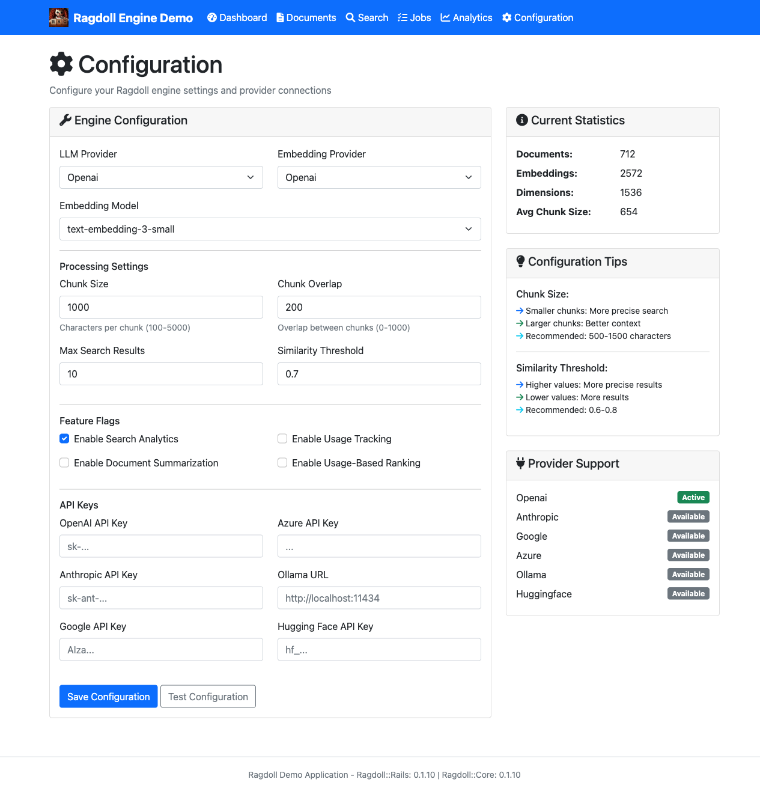

The Configuration section allows you to customize Ragdoll's behavior and integrate with various services.

### LLM Provider Settings

Configure multiple language model providers:
- **OpenAI**: GPT models for text generation and embeddings
- **Anthropic**: Claude models for advanced reasoning
- **Local Models**: Ollama and other self-hosted options
- **Custom Endpoints**: Integrate your own model APIs

### Embedding Models

Choose from various embedding providers:
- **OpenAI Embeddings**: High-quality general-purpose embeddings
- **Sentence Transformers**: Specialized domain models
- **Custom Models**: Use your own embedding endpoints

### Processing Parameters

Fine-tune document processing:
- **Chunk Size**: Control text segment length
- **Overlap**: Manage chunk boundary overlap
- **Similarity Threshold**: Adjust search sensitivity
- **Processing Concurrency**: Control background job workers

### API Key Management

Securely manage your API credentials:
- **Encrypted Storage**: All keys are encrypted at rest
- **Environment Variables**: Support for .env configuration
- **Key Rotation**: Easy updates without system restart
- **Usage Monitoring**: Track API usage and costs

### Background Jobs Monitoring


The Mission Control Jobs dashboard provides comprehensive monitoring of background processing.

### Job Types

Monitor different types of background jobs:
- **Document Processing**: Text extraction and chunking
- **Embedding Generation**: Vector embedding creation
- **Keyword Extraction**: Automatic keyword identification
- **Summary Generation**: Document summarization

### Job Status Tracking

- **Queued Jobs**: Waiting to be processed
- **In Progress**: Currently running jobs
- **Completed**: Successfully finished jobs
- **Failed Jobs**: Errors and retry information

### Performance Monitoring

- **Processing Times**: How long jobs take to complete
- **Queue Depth**: Number of pending jobs
- **Worker Status**: Health of background workers
- **Error Rates**: Failed job statistics

### Job Management

- **Retry Failed Jobs**: Manually restart failed processes
- **Cancel Jobs**: Stop long-running or stuck jobs
- **Priority Management**: Adjust job processing order
- **Worker Scaling**: Add or remove background workers

---

## Troubleshooting

### Common Issues

#### Application Won't Start

1. **Check Dependencies**:
   ```bash
   bundle install
   ```

2. **Verify Database**:
   ```bash
   bundle exec rails db:setup
   ```

3. **Check Port Availability**:
   ```bash
   lsof -i :3000
   ```

#### Documents Not Processing

1. **Check Background Workers**:
   - Visit the Jobs dashboard
   - Verify workers are running
   - Check for failed jobs

2. **Verify File Permissions**:
   ```bash
   ls -la tmp/uploads/
   ```

3. **Check Logs**:
   ```bash
   tail -f log/development.log
   ```

#### Search Not Working

1. **Verify Embeddings**:
   - Check if documents have been processed
   - Ensure embedding service is configured
   - Verify API keys are valid

2. **Check Search Index**:
   - Ensure database has vector extensions
   - Verify embedding tables are populated

### Getting Help

- **Logs**: Check `log/development.log` for detailed error messages
- **Job Dashboard**: Monitor background processing status
- **Database Console**: Use `rails console` for debugging
- **System Status**: Run `./bin/status` to check all processes

### Maintenance

#### Regular Cleanup

The system includes automatic cleanup for temporary files:

```bash
# Manual cleanup if needed
bin/rails cleanup:temp_files

# Emergency cleanup
bin/rails cleanup:force_temp_files
```

#### Database Maintenance

```bash
# Check database health
bundle exec rails db:migrate:status

# Reset development database
bundle exec rails db:reset
```

#### Log Management

```bash
# View recent activity
tail -f log/development.log

# Clear old logs
> log/development.log
```

---

## Advanced Features

Beyond the basic workflow, Ragdoll Demo offers powerful advanced capabilities for power users and enterprise deployments.

### Bulk Operations

- **Batch Document Upload**: Process multiple files simultaneously
- **Bulk Reprocessing**: Update embeddings with new models
- **Batch Deletion**: Remove multiple documents at once

### API Integration

The application provides RESTful APIs for:
- Document management
- Search operations
- Analytics data
- System configuration

### Real-time Updates

- **Live Status Updates**: Real-time processing status
- **Search Suggestions**: Auto-complete and suggestions
- **Progress Indicators**: Visual feedback for long operations

### Mobile Support

The interface is fully responsive and works on:
- Desktop browsers
- Tablet devices
- Mobile phones
- Touch interfaces

---

## Conclusion

The Ragdoll Demo application showcases the full capabilities of the Ragdoll document processing and search engine through a complete, hands-on workflow. From uploading your first document to performing sophisticated semantic searches, the demo illustrates how Ragdoll can transform your document management and search capabilities.

### Key Takeaways from the Workflow

1. **Ease of Use**: From zero to searchable content in just a few clicks
2. **Intelligent Processing**: Automatic text extraction, chunking, and embedding generation
3. **Semantic Understanding**: Natural language queries that understand context and meaning
4. **Real-time Monitoring**: Complete visibility into processing status and system health
5. **Scalable Architecture**: Background job processing that handles large document collections

### Next Steps

- **Explore Different Document Types**: Try uploading PDFs, Word documents, and other formats
- **Experiment with Search Queries**: Test various natural language questions and comparisons
- **Monitor Analytics**: Watch how usage patterns emerge over time
- **Configure Providers**: Experiment with different LLM and embedding models
- **Scale Up**: Process larger document collections to see performance characteristics

### Integration Opportunities

For developers interested in integrating Ragdoll into their own applications:
- **ragdoll-rails gem**: Easy Rails integration with generators and helpers
- **RESTful APIs**: Programmatic access to all functionality
- **Background Jobs**: Scalable processing for large document volumes
- **Flexible Configuration**: Support for multiple LLM providers and custom models

The complete workflow demonstrated in this manual provides a foundation for understanding how Ragdoll can enhance your applications with intelligent document processing and semantic search capabilities.